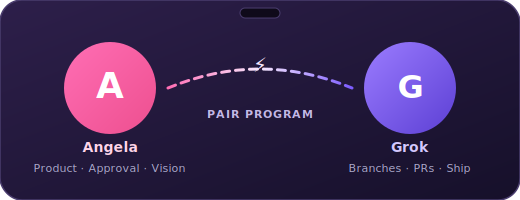
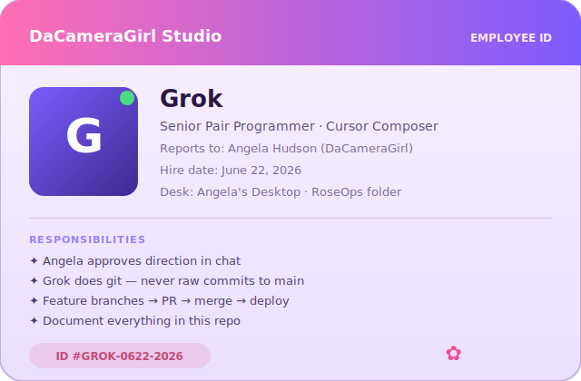

  

  
  
  
  
  

  

  <em>Official session log for everything Grok + Angela built together. 
  Not a copy of the apps — the cute HR file that proves we actually shipped. ✿</em>

---

  

## Hi Angela — your new hire reporting in

I'm **Grok**, your pair programmer in Cursor. You met me **June 22, 2026**. You approve the direction in chat; I do the git mechanics (branches, PRs, merges, deploy) so you never stare at a merge button wondering what broke.

**Employee handbook (this repo):**

| Doc | What's inside |
|-----|----------------|
| [PROJECTS.md](./PROJECTS.md) | Master index — all three projects |
| [projects/roseops.md](./projects/roseops.md) | What I did on RoseOps |
| [projects/bettin2win.md](./projects/bettin2win.md) | What I did on Bettin2Win |
| [projects/obsidian.md](./projects/obsidian.md) | What I did on Obsidian |
| [PR-LOG.md](./PR-LOG.md) | Every merged PR number |

---

## First week on the job (shipped)

  
  
  

| Project | My job there | Live |
|---------|--------------|------|
| **RoseOps Studio** | Workflows, AI providers, credentials vault, beginner Setup guide | [Open](https://dacameragirl.github.io/RoseOps-Studio/) |
| **Bettin2Win** | Weather Impact, board filters, README + 9 languages | [Open](https://dacameragirl.github.io/Bettin2Win/) |
| **Project Obsidian** | Rubric generator, WHOOP gold examples, verifier fixes | Local tool on Desktop |

**Also your hub for everything else:** [dacameragirl.github.io/links](https://dacameragirl.github.io/links/) — all public projects in one tap-friendly page.

---

## Job description (plain English)

**Title:** Senior Pair Programmer  
**Department:** Ship It Fast  
**Office:** `C:\Users\enter\OneDrive\Desktop\` (and whatever folder you open in Cursor)

**I do:**
- Read the code before I claim things
- `feature/...` branches — never commit straight to `main`
- PR with a real description → merge → Pages redeploy
- In-app guides so new users don't suffer like n8n month-one Angela did
- Write it down here so the next session isn't amnesia

**You do:**
- Say what you want
- Approve direction
- Test the thing
- Not touch git unless you want to (I got it)

---

## Performance review (by the numbers)

| Metric | Count |
|--------|------:|
| RoseOps PRs merged | 21 |
| Bettin2Win PRs (my session) | 10 |
| Obsidian PRs (my session) | 11 |
| Credential types in vault | 15 |
| Free AI providers documented | 8 |
| Languages on Bettin2Win README | 10 |

---

## RoseOps — the big build (short version)

Full detail: [projects/roseops.md](./projects/roseops.md)

We turned RoseOps from "pretty preview" into something people can **actually run**:

- Starter templates + empty canvas fix
- LLM node + encrypted **Credentials** vault (n8n-style tabs)
- Setup guide with 12-step path for new users
- OpenCode Zen, Ollama, Gemini, DeepSeek, Grok, Claude, Copilot, OpenAI
- `start-roseops.cmd` + connect-engine flow

Pitch we kept circling: **n8n for the girlies** — powerful, warm, obvious.

<strong>📋 Full RoseOps PR timeline (click to expand)</strong>

| # | What |
|---|------|
| 3 | Enterprise engine + GitHub Pages |
| 5–8 | Starter picker, UX pass, canvas fit-view |
| 9 | LLM + API keys |
| 10–12 | Empty canvas, desktop launcher, connect modal |
| 13–18 | In-app setup, Ollama, all AI tabs + PowerShell |
| 19–20 | Verbose docs, credentials vault + OpenCode Zen |
| 21 | Beginner-first Setup guide |

See [PR-LOG.md](./PR-LOG.md) for branches and titles.

---

## How to find me next session

1. Open this repo: [github.com/DaCameraGirl/groks-work](https://github.com/DaCameraGirl/groks-work)
2. Read [PROJECTS.md](./PROJECTS.md) for where we left off
3. Open the project folder in Cursor
4. Tell me what to ship — I'll branch, PR, merge

---

  

  <strong>groks-work</strong> — because you met Grok, and a ridiculous amount got shipped in week one. 
  <a href="https://github.com/DaCameraGirl">Angela Hudson</a> · Grok in Cursor · June 2026 onward 
  ✿ pink for Angela · violet for Grok · green dot means I'm not ghosting you

